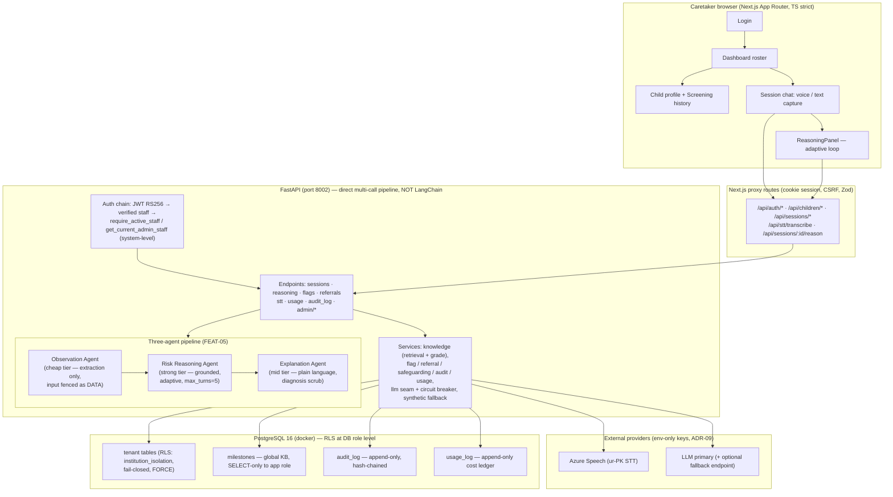
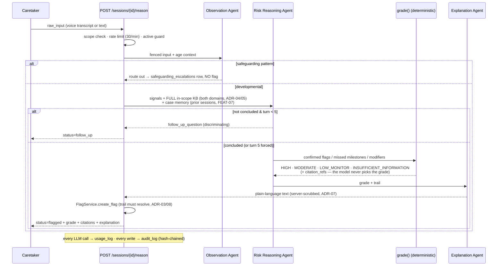

# SIGNAL — Architecture Diagram (FEAT-13 deliverable)

**Date:** 2026-08-31 · Phase 1 as-built (FEAT-01 → FEAT-12 + RBAC/Admin Panel)

## System overview

## The reasoning loop (one turn)

## Trust boundaries at a glance

| Boundary | Mechanism |
|---|---|
| Tenant isolation | JWT-signed `institution_id` claim + app-layer scoping on EVERY endpoint + Postgres RLS (ENABLE+FORCE, fail-closed) for the unprivileged `signal_app` role |
| Admin (system-level) | `get_current_admin_staff` — DB row is the privilege authority; cross-institution ONLY on marked admin endpoints |
| Tamper-evidence | hash-chained append-only `audit_log` (UPDATE/DELETE revoked at DB level) + `/audit_log/integrity` |
| Secrets | env-var only (ADR-09); no key storage surface anywhere |
| Grounding | citations validated server-side against the injected knowledge universe; `grade()` deterministic (ADR-06) |
| Cost/DoS | rate limits (30/min capture+reasoning, 5/5min provider tests) + `usage_log` visibility + max_turns=5 |
